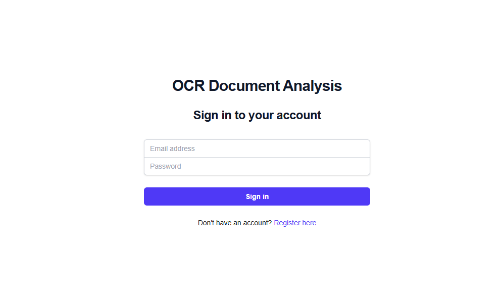
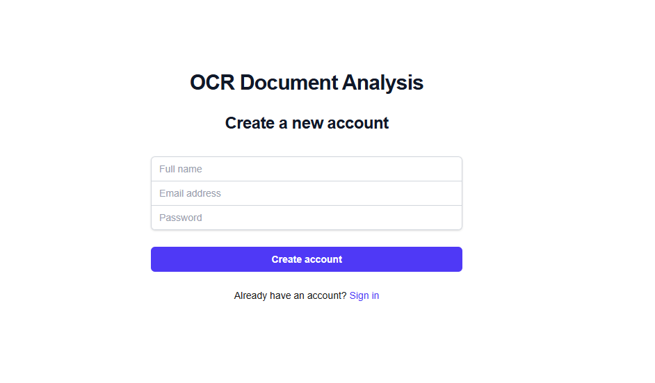
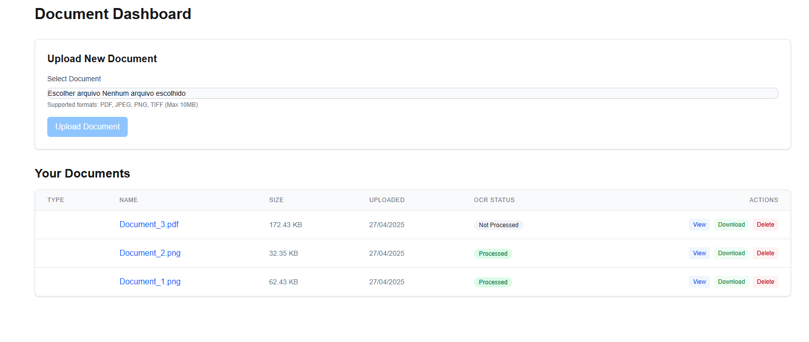
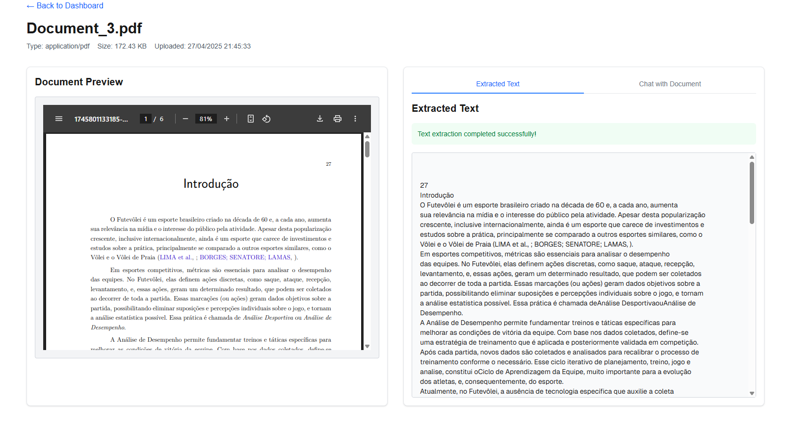
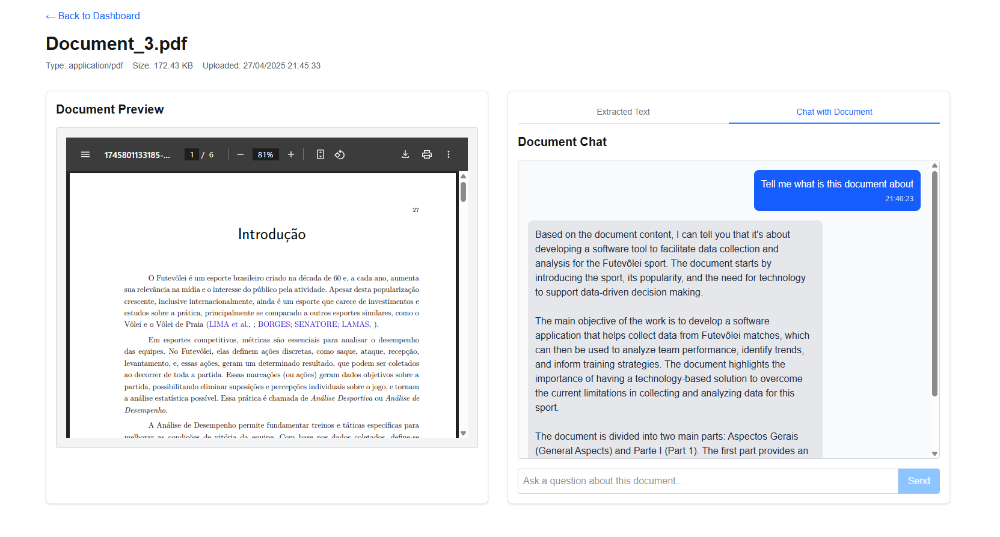

# OCR Case

A web application that allows users to upload documents, extract text using OCR, and get interactive explanations of the extracted data using local LLM technology.

## Tech Stack

- **Frontend**: React with Next.js
- **Backend**: NestJS
- **Database**: PostgreSQL with Prisma ORM
- **Authentication**: JWT with NextAuth.js
- **OCR**: Tesseract.js
- **LLM**: Ollama (local LLM)
- **Containerization**: Docker

## Features

- Document upload and management (PDF, JPEG, PNG, TIFF)
- OCR text extraction from both text-based and scanned documents
- Interactive document analysis using local LLM
- Document-specific conversations
- User authentication and authorization
- Responsive design

## Application Screenshots

The application provides a user-friendly interface for managing documents and interacting with the LLM. Below are some key screenshots.

### Authentication

The application provides secure user authentication with JWT tokens and NextAuth.js integration. Users can register for a new account or log in with existing credentials. All document operations are protected and associated with specific user accounts.

<div align="center">
<table>
  <tr>
    <td align="center" width="50%">
      <h4>Login</h4>
      
    </td>
    <td align="center" width="50%">
      <h4>Register</h4>
      
    </td>
  </tr>
</table>
</div>

### Document Management

The document dashboard provides a centralized interface for managing all your uploaded documents. From here, you can:

- **View documents**: Click on any document to see its extracted text and interact with the LLM
- **Upload new documents**: Add PDF, JPEG, PNG, or TIFF files through the intuitive upload interface
- **Delete documents**: Remove documents you no longer need with a simple click

#### Document Dashboard


### OCR and LLM Analysis

The core functionality of the application combines OCR capabilities with LLM-based analysis:

- **Text extraction**: Extracts text from the documents
- **Document chat**: Ask questions about the document content and receive contextual responses
- **Intelligent analysis**: The LLM understands the document context and can explain some concepts
- **Conversation history**: All interactions with the LLM are saved for future reference

#### Text Extraction


#### Document Chat



## Running the Application Locally

### Prerequisites

- Docker and Docker Compose
- Git

### Installation

1. Clone the repository
   ```bash
   git clone https://github.com/yourusername/OCR-Case.git
   cd OCR-Case
   ```

2. Start the application using Docker Compose
   ```bash
   docker compose up -d
   ```

3. The application will be available at:
   - Frontend: [http://localhost:3000](http://localhost:3000)
   - Backend API: [http://localhost:5005](http://localhost:5005)

4. Register a new account to get started

### LLM Model Selection

The application uses Ollama to run LLM models locally. By default, it's configured to use the `llama3` model, but you can switch to other models for different performance/resource tradeoffs.

#### Available Models

- **llama3** (4.7GB): High-quality responses but requires more resources
- **tinyllama** (637MB): Faster responses with lower resource usage

#### Pulling a Model

Pull a model using the following command:

```bash
# Pull the llama3 model
docker compose exec ollama ollama pull llama3

# OR pull the tinyllama model
docker compose exec ollama ollama pull tinyllama
```

#### Switching Models

1. Edit the `docker-compose.yml` file to specify which model to use:

   ```yaml
   backend:
     environment:
       # ...
       - OLLAMA_MODEL=llama3  # Change to tinyllama if preferred
   ```

2. Restart the backend service:

   ```bash
   docker compose restart backend
   ```

### Using GPU Acceleration (NVIDIA GPUs)

The application is configured to use GPU acceleration if available. Make sure you have:
- NVIDIA GPU with updated drivers
- NVIDIA Container Toolkit installed

The GPU configuration is already set in the docker-compose.yml file:

```yaml
ollama:
  # ...
  deploy:
    resources:
      reservations:
        devices:
          - driver: nvidia
            count: 1
            capabilities: [gpu]
  environment:
    - NVIDIA_VISIBLE_DEVICES=all
```

## Troubleshooting

- **OCR Processing Errors**: Make sure the backend container has the necessary dependencies for image processing (included in the Dockerfile)
- **LLM Not Responding**: Check if the model has been pulled correctly with `docker compose exec ollama ollama list`
- **GPU Not Detected**: Verify your NVIDIA drivers and Container Toolkit installation

## License

This project is licensed under the MIT License - see the [LICENSE](LICENSE) file for details.

MIT License is a permissive license that allows anyone to use, modify, distribute, and sell this software, provided that the original copyright notice and the license text are included in all copies or substantial portions of the software.